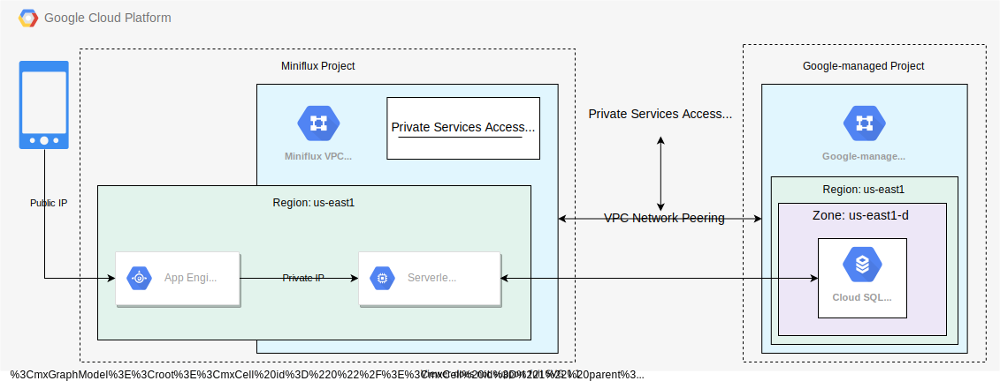

# Miniflux for Google Cloud Platform (GCP) App Engine

This Terraform module sets up the infrastructure (such as the VPC network and database) to run [Miniflux](https://miniflux.app/), a free and open-source feed reader, in App Engine on Google Cloud Platform (GCP) in a secure manner.

Below is a diagram of how the infrastructure is set up based on this [sample Terraform config](https://github.com/huy-nguyen/terraform-google-miniflux/blob/master/examples/minimal.tf):



The [infrastructure requirements](https://miniflux.app/docs/requirements.html) to run Miniflux are fairly minimal: a Linux operating system and a PostgreSQL database.
The end-user accesses Miniflux through a browser-based user interface served by an App Engine instance on a public IP address.
This setup uses [private services access](https://cloud.google.com/vpc/docs/private-services-access), which allows service providers (Google itself in this case) to provide services (a PostgreSQL database) on internal IP addresses (192.168.16.3).
This is a win in terms of security (the database is never exposed to the public internet and its associated risks), performance (communication using private IP addresses has lower latency than that using public IP addresses) and costs (no [network egress traffic](https://cloud.google.com/vpc/network-pricing#general) is charged).
The database's privacy is guaranteed because it actually resides in a completely separate VPC network managed by Google.
That VPC network is in turn created by a project also managed by Google.
Communication between your project's network and the Google-managed VPC network containing the database is enabled by [VPC network peering](https://cloud.google.com/vpc/docs/vpc-peering).
To make this peering work, a private IP address range (192.168.16.0/20) is reserved in your VPC network so that Google can use that range to provision an IP address for the database (notice that 192.168.16.3 is within 192.168.16.0/20).
Because the App Engine instance is not part of the VPC network and the database is only reachable via an internal IP address, this module also creates a [serverless VPC access connector](https://cloud.google.com/vpc/docs/configure-serverless-vpc-access) to allow the App Engine to communicate with the database.
You can think of this connector as a tiny network address translation (NAT) machine just for the App Engine instance.
(In fact, this connector is [priced by Google](https://cloud.google.com/vpc/network-pricing#serverless-vpc-pricing) as "one `e2-micro` instance per 100 Mbps of throughput".)

Note that this Terraform module does not set up App Engine itself, just all the infrastructure that App Engine will need to function properly.
However, I've included instructions on how to use the outputs from the module to create the configuration for App Engine.

# Prerequisites

Before starting, you will have to enable the following Google APIs in your project:

- Compute Engine API (`compute.googleapis.com`).
- Service Networking API (`servicenetworking.googleapis.com`).
- Cloud Resource Manager API (`cloudresourcemanager.googleapis.com`).
- Serverless VPC Access API (`vpcaccess.googleapis.com`).
- Cloud SQL Admin API (`sqladmin.googleapis.com`).
- App Engine Admin API (`appengine.googleapis.com`).

Ensure that the credentials (e.g. your own account or a service account) used by Terraform are granted the following IAM roles on the project:

- Compute Network Admin (`roles/compute.networkAdmin`).
- Service Networking Admin (`roles/servicenetworking.networksAdmin`).
- Serverless VPC Access Admin (`roles/vpcaccess.admin`).
- Cloud SQL Admin (`roles/cloudsql.admin`).

# Infrastructure provisioning

You can use the provided [sample Terraform config](https://github.com/huy-nguyen/terraform-google-miniflux/blob/master/examples/basic/) as a starting point.

First, ensure that you're authenticated by following [these instructions](https://registry.terraform.io/providers/hashicorp/google/latest/docs/guides/provider_reference#authentication), then run the following commands:

- `terraform init`
- `terraform plan`
- `terraform apply`
- `terraform output` to get the output values that will be necessary in deploying App Engine next.

# Deployment to App Engine

After deploying this module, you'll need to perform the following steps to get a working version of Miniflux:

- Clone the [Miniflux repo](https://github.com/miniflux/v2), `cd` into the directory and check out a [release tag](https://github.com/miniflux/v2/tags).
- Use the outputs exposed by this Terraform module to create an `app.yaml` file with the following content:

```yaml
runtime: go111
vpc_access_connector:
  name: value of the vpc_access_connector_id output
env_variables:
  CLOUDSQL_CONNECTION_NAME: value of the sql_connection_name output
  CLOUDSQL_USER: value of the sql_instance_user output
  CLOUDSQL_PASSWORD: value of the db_user_password you pass into the module

  CREATE_ADMIN: 1
  ADMIN_USERNAME: pick any name you want for the initial login
  ADMIN_PASSWORD: pick any password you want for the initial login
  RUN_MIGRATIONS: 1
  DATABASE_URL: value of the database_url output. Remember to substitute the placeholder password with the real password i.e. the Terraform input variable "db_user_password"
```

- We'll use the `gcloud` CLI to deploy to App Engine.
  Ensure you're authenticated with the `gcloud` CLI.
  If not, run `gcloud auth login`.
- Ensure you've picked the correct project.
  Run `gcloud config get-value project` to check.
  If the project is not correct, run `gcloud config set project [PROJECT-NAME]` to set it.
- Run `gcloud app deploy`.
  You will be prompted to choose a region.
  Pick the same region as the `region` input variable of this Terraform module.
- After the first App Engine version has been created, you _might_ have to give the default App Engine service account the Cloud SQL Client role (`roles/cloudsql.client`) so that it can access the database.
  This service account's email address has the form `YOUR_PROJECT_ID@appspot.gserviceaccount.com`.

Now you can navigate to your App Engine's URL and log in with the `ADMIN_USERNAME` and `ADMIN_PASSWORD` specified above.
